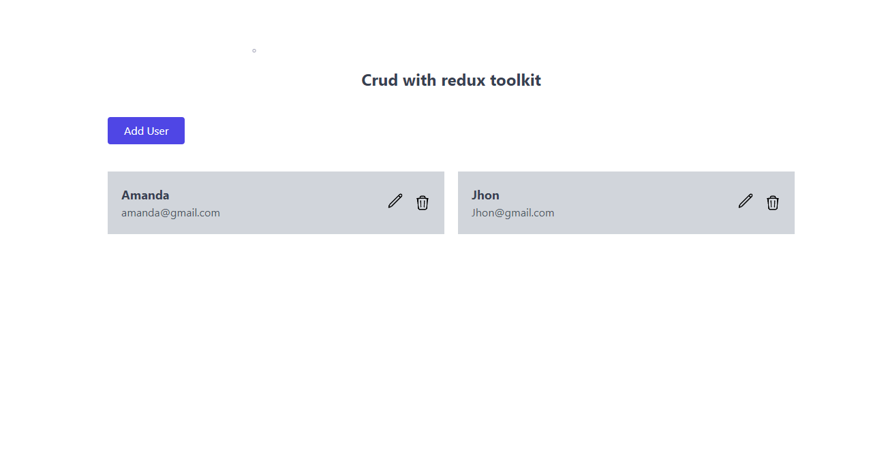
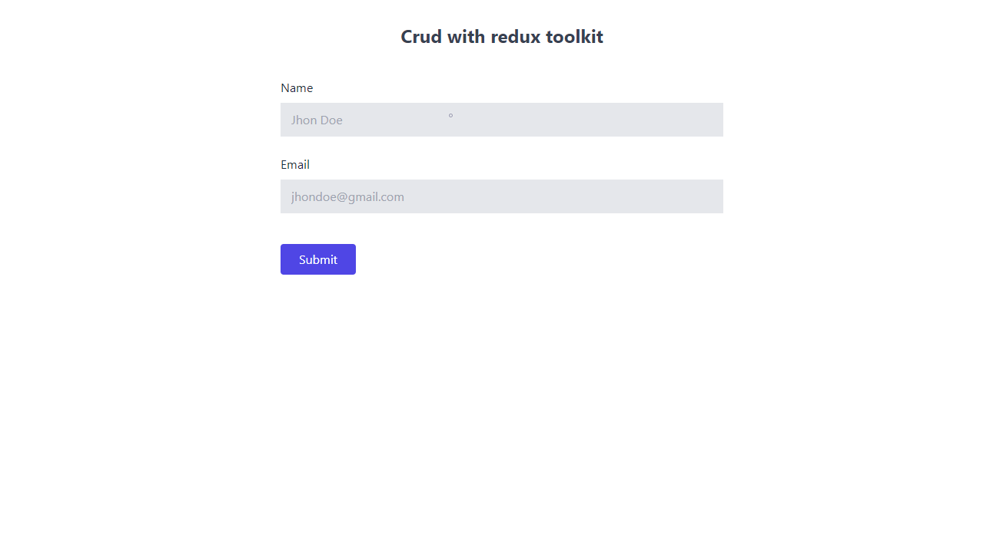
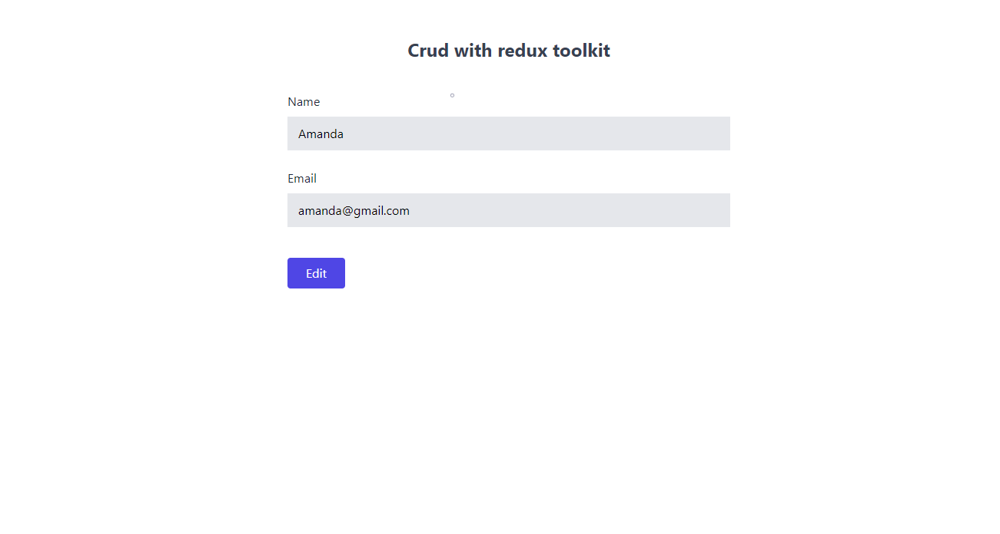

# CRUD con React y Redux

Este proyecto fue creado con React, una biblioteca de JavaScript para construir aplicaciones web. Además, se utilizó UUID para generar identificadores únicos para cada persona registrada en la aplicación, ReactRouter para manejar las rutas de la aplicación, y Redux Toolkit para el manejo de estados. La aplicación permite registrar, editar y eliminar información básica de una persona, como su correo y nombre. La aplicación es responsiva y está en inglés. Para los estilos se utilizó TailwindCSS y Hero Icon.

## Tecnologías principales
-  React
-  Redux Toolkit
-  React-router
-  Tailwind

## Capturas de pantalla

## Créditos
Este proyecto fue creado a partir de un video tutorial de YouTube del canal Cand Dev: https://www.youtube.com/watch?v=SgnlgEEkqSo&t=1s

## Link
Puedes ver la aplicación en funcionamiento en el siguiente enlace:
[Live site URL](https://crud-react-redux-toolkit.netlify.app)
